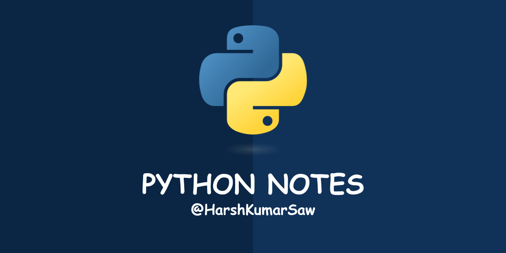

# PYTHON-NOTES



Welcome to my Python Notes repository! This repository contains a collection of personal notes, concepts, and code snippets that I’ve learned while studying Python. These notes aim to help anyone looking to learn Python, understand key concepts, and improve their problem-solving skills.

## Contents

**Python Concepts:** Key programming concepts and techniques explained through notes.

**Code Snippets:** Practical examples and solutions to common problems in Python.


## Learning Source

I learned Python through the Code with Harry YouTube channel, specifically the Python tutorial playlist for absolute beginners. The playlist covers fundamental concepts and provides step-by-step guidance for building your Python skills.

You can access the full playlist [here](https://youtube.com/playlist?list=PLu0W_9lII9agICnT8t4iYVSZ3eykIAOME&si=qrJh-JVGp8zVM8l3)

## License

This repository is open for usage, modification, and distribution under the [MIT](https://github.com/HarshKumarSaw/Python-Notes/blob/main/LICENSE) License. Feel free to fork, clone, and contribute to the repository as per the terms of the license.

## How to Use

1. Clone this repository using the following command:

```bash
https://github.com/HarshKumarSaw/Python-Notes.git
```


2. Navigate through the files to explore different notes and code snippets.


3. For running any Python code, make sure Python is installed on your system. You can download it from the official Python website.


## Contributing

I welcome contributions to enhance this repository. You can:

* Suggest improvements or submit issues.

* Fork the repository, make your changes, and submit a pull request.
